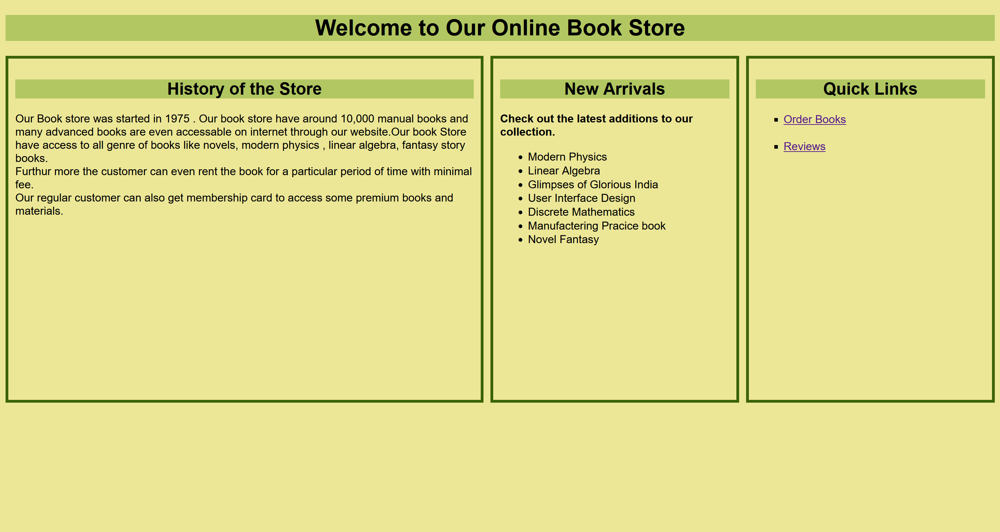

# 📚 Online Book Store

A simple web-based application for an **Online Book Store**. This platform allows users to:

1. 🛒 **Order a Book**
2. ✍️ **Give a Review**

## 🌐 Overview

This project provides a basic front-end interface for browsing and purchasing books online. It’s ideal for learning HTML, CSS, and possibly JavaScript while simulating a basic e-commerce experience.

### 🔹 Features

- 📖 Book ordering section with input fields
- ⭐ Review section to collect user feedback
- Clean, simple UI for user interaction

## 🛠 Technologies Used

- HTML5  
- CSS3  
- JavaScript 


## 🚀 How to Run

1. Clone the repository:
   ```bash
   git clone https://github.com/shreya-13-04/Online-Book-Store.git
   ```

2. Open index.html in any web browser.

- No installation or server setup is needed — just open and run!

🖼 Screenshots 




## 👩‍💻 Author
GitHub: https://github.com/shreya-13-04

## 📄 License
This project is licensed under the MIT License — feel free to use, modify, and share!